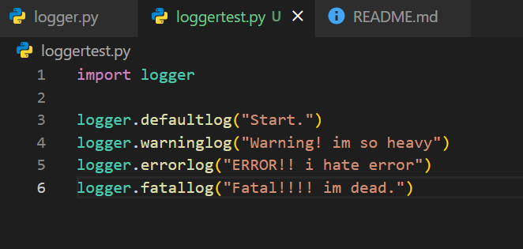
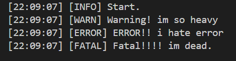

# Logger 1.0 - Make Peaisyamyam

```
make by peaisyamyam, 1.0 version
```

## Default-log
```
defaultlog("Test") # [--:--:--] [INFO] Test
```

## Warning-log
```
warninglog("Test") # [--:--:--] [WARN] Test
```

## Error-log
```
errorlog("Test") # [--:--:--] [ERROR] Test
```

## Fatal-log
```
fatallog("Test") # [--:--:--] [FATAL] Test
```
NOTE : This Logger is use datetime moduel.

example : 



enjoy!